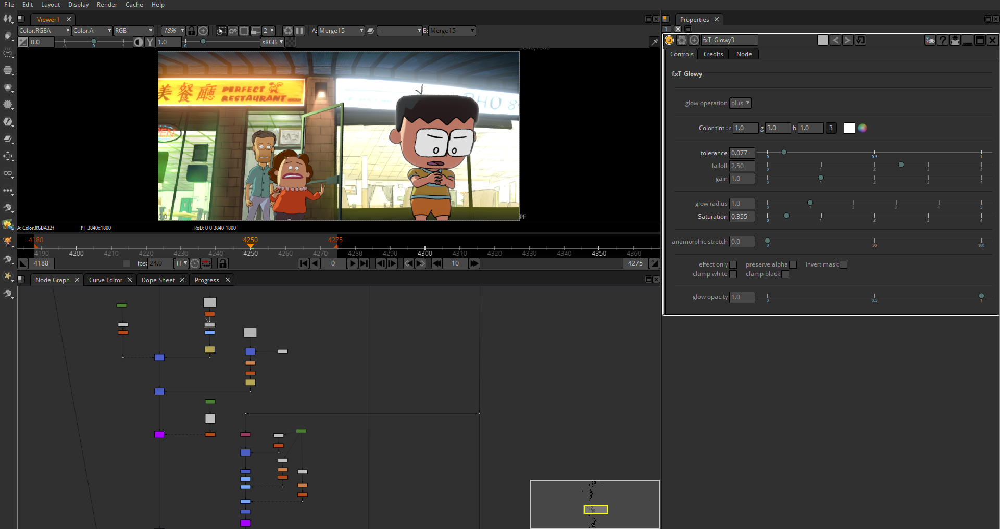

# About

### Cross-platform open-source compositor for the visual effects industry

Natron is a powerful free and open-source VFX compositor geared towards digital post-production work, with industry-standard UI, 100+ nodes, and support for OpenFX and community-made plugins. With its robust OpenFX based engine and support for OpenImageIO and OpenColorIO, Natron can handle all of your VFX post-production needs.

Natron was a proud recipient of [Inria](https://www.inria.fr/en) funding from 2013–2018, and is currently being developed by a team of open-source contributors as a community effort.

We accept feature requests and bug reports [on GitHub](https://github.com/natronGitHub/natron/issues).

## Development

We are always on the lookout for new contributions to Natron, be they minor bug fixes or big new features. As such, we regularly review the GitHub and accept pull requests. If you are a developer who is well versed in C++, Qt, and graphics programming, and are interested in contributing, please do not hesitate to reach out to us!

For instructions on how to build Natron from source, read through [the README document here.](https://github.com/NatronGitHub/Natron#building-and-installing-from-source)

## FAQ

- #### Is Natron really free?
  Yes, Natron is free software. Free to use, free to modify, and free to share, due to its open-source GNU GPL license.

- #### What can Natron do?
  Natron is a powerful digital compositor capable of handling a multitude of VFX and post-production tasks. Natron's capabilities include but are not limited to:
   * Linear node-based workflow
   * 32bit/channel floating-point linear processing pipeline
   * Industry-standard OIIO file format support
   * Powerful chroma-keying and matte refinement
   * Industry-standard rotoscoping and rotopaint
   * Pixel-perfect tracking and stabilization
   * Industry-standard OCIO color management
   * Extensive OpenFX and community plugins support
   * And much more!

  Natron can be used in conjunction with [Blender](https://www.blender.org/) to extend it's capabilities by utilising Blender's 3D environment. This is facilitated by Natron's support for CHAN files for transferring camera tracking data.

- #### Does the Natron Project accept donations?
  While we appreciate your generosity, the Natron Project does not currently accept donations.

- #### Where can I find brand assets for Natron?
  If you wish to add Natron to the credits of your project or use the logo for other non-commercial purposes, you can download the logomark on our [brand assets page](/brand).
